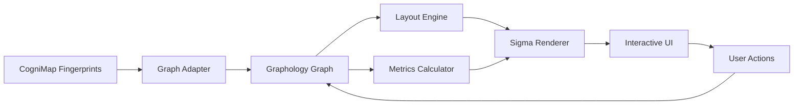

# 🚀 CogniMap Advanced Visualization System - Master Roadmap

**Created**: 2025-01-08  
**Version**: 1.0.0  
**Status**: In Development  
**Branch**: feature/cognimap-visualization-tools

---

## 📌 Executive Summary

This document serves as the permanent reference for implementing an InfraNodus-inspired advanced visualization system for CogniMap. The system will transform our current static Mermaid diagrams into an interactive, intelligent graph visualization platform using Graphology and Sigma.js.

**Core Goal**: Create a professional, interactive architecture visualization system that can handle 10,000+ components with real-time analysis and insights.

---

## 🏗️ System Architecture

### Technology Stack

```
Frontend Layer:
├── Sigma.js 2.x         - WebGL graph rendering
├── Graphology 0.25.x    - Graph data structure
├── ForceAtlas2          - Primary layout algorithm
└── Web Workers          - Offload computations

Analysis Layer:
├── Centrality Metrics   - Component importance
├── Community Detection  - Subsystem discovery
├── Dependency Analysis  - Architecture health
└── Pattern Recognition  - Anti-pattern detection

Data Layer:
├── JSON Storage         - Current (keep as-is)
├── In-Memory Graph      - Graphology instance
├── IndexedDB           - Client-side caching
└── Neo4j (Phase 4)     - Optional future upgrade
```

### Data Flow Architecture



---

## 📊 Implementation Phases

### ✅ PHASE 1: Foundation Layer (Days 1-7)
**Goal**: Basic interactive visualization working

#### Day 1-2: Setup & Installation
```bash
# Dependencies to install
npm install --save \
  graphology \
  graphology-layout \
  graphology-layout-forceatlas2 \
  sigma \
  graphology-metrics \
  graphology-components \
  graphology-shortest-path
```

**Files to Create**:
- `/cognimap/visualizer/engine/graph-adapter.js`
- `/cognimap/visualizer/engine/sigma-renderer.js`
- `/cognimap/visualizer/package.json`

#### Day 3-4: Graph Adapter Implementation
```javascript
// Core adapter structure
class CogniMapGraphAdapter {
  constructor(cogniMapData) {
    this.graph = new Graph();
    this.buildFromCogniMap(cogniMapData);
  }
  
  buildFromCogniMap(data) {
    // Convert fingerprints to nodes
    // Convert relationships to edges
    // Add metadata attributes
  }
}
```

#### Day 5-6: Basic Visualization
- Implement Sigma.js renderer
- Add ForceAtlas2 layout
- Create simple HTML interface
- Pan/zoom controls

#### Day 7: Testing & Documentation
- Verify with current graph data
- Document API
- Performance baseline

**Success Criteria**:
- [ ] Graph renders with 98 current components
- [ ] Interactive pan/zoom works
- [ ] ForceAtlas2 layout applies
- [ ] Load time < 2 seconds

---

### 🔧 PHASE 2: Intelligence Layer (Days 8-14)
**Goal**: Add network analysis capabilities

#### Day 8-9: Centrality Metrics
```javascript
// Identify critical components
import { betweennessCentrality, degreeCentrality } from 'graphology-metrics';

class MetricsCalculator {
  calculateImportance() {
    // Betweenness - find bridge components
    // Degree - find hub components
    // PageRank - overall importance
  }
}
```

#### Day 10-11: Community Detection
```javascript
// Auto-discover subsystems
import louvain from 'graphology-communities-louvain';

class CommunityDetector {
  detectSubsystems() {
    // Louvain algorithm
    // Color nodes by community
    // Group related components
  }
}
```

#### Day 12-13: Dependency Analysis
- Circular dependency detection
- Coupling metrics
- Dead code identification
- Architecture health score

#### Day 14: Integration & Testing
- Connect all metrics to UI
- Add visual encoding (size, color)
- Performance optimization

**Success Criteria**:
- [ ] Centrality metrics calculate < 1 second
- [ ] Communities visually distinct
- [ ] Circular dependencies highlighted
- [ ] Health score displayed

---

### 🎨 PHASE 3: User Experience (Days 15-21)
**Goal**: Professional interactive interface

#### Day 15-16: Enhanced Interactions
- Node selection & details
- Edge filtering by weight
- Cluster collapse/expand
- Search functionality

#### Day 17-18: Visual Modes
```javascript
// Different visualization modes
const layouts = {
  force: ForceAtlas2Layout,
  hierarchy: HierarchicalLayout,
  circular: CircularLayout,
  subsystem: ClusteredLayout
};
```

#### Day 19-20: Filters & Analysis
- Filter by component type
- Filter by semantic tags
- Time-based evolution view
- Dependency path highlighting

#### Day 21: Polish & Optimization
- Smooth transitions
- Loading states
- Error handling
- Export capabilities

**Success Criteria**:
- [ ] 60 FPS interaction
- [ ] Search responds instantly
- [ ] Multiple layout options work
- [ ] Export to PNG/SVG/JSON

---

### 🚀 PHASE 4: Production Ready (Week 4+)
**Goal**: Enterprise-grade system

#### Week 4: Advanced Features
- **Real-time Updates**: WebSocket integration
- **Collaborative Mode**: Multi-user exploration
- **AI Insights**: Architecture recommendations
- **Git Integration**: Show evolution over time

#### Week 5: Performance & Scale
- **Large Graph Support**: 10,000+ nodes
- **Virtualization**: Render only visible nodes
- **Progressive Loading**: Load details on demand
- **GPU Acceleration**: WebGL optimizations

#### Week 6: API & Integration
```javascript
// RESTful API
GET /api/graph/full
GET /api/graph/subsystem/{name}
GET /api/analysis/metrics
POST /api/graph/layout

// GraphQL API
query {
  graph(scope: "full") {
    nodes { id, type, centrality }
    edges { source, target, weight }
  }
}
```

#### Week 7-8: Testing & Documentation
- Unit tests for all components
- Integration tests
- Performance benchmarks
- User documentation
- API documentation

---

## 📈 Performance Targets

| Metric | Target | Measurement Method |
|--------|--------|-------------------|
| Initial Load | < 3 seconds | Performance API |
| Graph Render | < 1 second | RequestAnimationFrame |
| Layout Calculation | < 2 seconds | Web Worker timing |
| Interaction FPS | 60 FPS | Chrome DevTools |
| Memory Usage | < 500MB | Performance Monitor |
| Max Nodes | 10,000+ | Stress testing |

---

## 🔄 Migration Strategy

### From Current System
1. **Keep existing GraphBuilder** - Use as data source
2. **Parallel Development** - Old and new systems side-by-side
3. **Gradual Migration** - Component by component
4. **Fallback Option** - Keep Mermaid as backup

### Data Compatibility
```javascript
// Adapter pattern for seamless migration
class GraphDataAdapter {
  fromCogniMap(data) { /* current format */ }
  fromGraphology(graph) { /* new format */ }
  toMermaid() { /* fallback */ }
  toSigma() { /* new viz */ }
}
```

---

## 🎯 Success Metrics

### Technical Metrics
- [ ] Render 98 current components smoothly
- [ ] Scale to 10,000+ nodes
- [ ] Sub-second interactions
- [ ] Memory efficient (< 500MB)
- [ ] Cross-browser compatible

### User Experience Metrics
- [ ] Intuitive navigation
- [ ] Insightful analysis
- [ ] Beautiful visualizations
- [ ] Actionable recommendations
- [ ] Export capabilities

### Business Value Metrics
- [ ] Faster architecture reviews
- [ ] Earlier problem detection
- [ ] Better documentation
- [ ] Improved onboarding
- [ ] Enhanced decision making

---

## 🚧 Risk Mitigation

| Risk | Mitigation Strategy |
|------|-------------------|
| Performance issues with large graphs | Implement virtualization and LOD |
| Browser compatibility | Test on Chrome, Firefox, Safari, Edge |
| Learning curve for developers | Comprehensive documentation |
| Breaking changes in libraries | Pin versions, extensive testing |
| Data loss during migration | Keep parallel systems, backups |

---

## 📚 Reference Resources

### Documentation
- [Graphology Docs](https://graphology.github.io/)
- [Sigma.js Docs](https://www.sigmajs.org/)
- [ForceAtlas2 Paper](https://journals.plos.org/plosone/article?id=10.1371/journal.pone.0098679)

### Examples
- [InfraNodus](https://infranodus.com)
- [Gephi](https://gephi.org/)
- [NetworkX](https://networkx.org/)

### Our Files
- Graph Data: `/cognimap/visualizer/output/architecture_graph.json`
- Current Implementation: `/cognimap/graph/graph_builder.py`
- Test Data: 98 components, 388 relationships

---

## 📝 Implementation Checklist

### Immediate Actions
- [ ] Create this roadmap document
- [ ] Set up package.json with dependencies
- [ ] Create directory structure
- [ ] Install Graphology and Sigma.js
- [ ] Create basic adapter

### Week 1 Deliverables
- [ ] Working prototype with current data
- [ ] Basic interactive visualization
- [ ] ForceAtlas2 layout functioning
- [ ] Simple dashboard HTML

### Week 2 Deliverables
- [ ] Network metrics integrated
- [ ] Community detection working
- [ ] Visual encoding complete
- [ ] Search and filter functional

### Week 3 Deliverables
- [ ] Multiple layout options
- [ ] Advanced interactions
- [ ] Performance optimized
- [ ] Documentation complete

### Month 2 Goals
- [ ] Production-ready system
- [ ] Full test coverage
- [ ] API implemented
- [ ] Deployed and monitored

---

## 🔄 Version History

| Version | Date | Author | Changes |
|---------|------|--------|---------|
| 1.0.0 | 2025-01-08 | Claude | Initial roadmap creation |

---

## 📞 Contact & Support

- **Project**: COGPLAN/UMA-V2
- **Repository**: https://github.com/Ramz369/UMA-V2
- **Branch**: feature/cognimap-visualization-tools
- **Documentation**: /cognimap/docs/

---

**This document is the source of truth for the CogniMap visualization system implementation.**