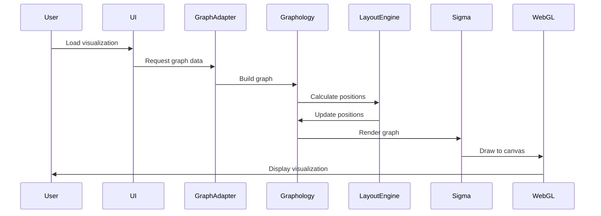

# 🔧 Technical Specification - CogniMap Advanced Visualization

**Version**: 1.0.0  
**Last Updated**: 2025-01-08  
**Status**: Draft

---

## 1. System Overview

### 1.1 Purpose
Transform CogniMap's static architecture diagrams into an interactive, intelligent graph visualization system capable of real-time analysis and insights.

### 1.2 Scope
- Interactive graph visualization using WebGL
- Network analysis algorithms
- Real-time metrics calculation
- Multiple layout algorithms
- Export capabilities

---

## 2. Technical Requirements

### 2.1 Performance Requirements

| Requirement | Specification | Rationale |
|------------|--------------|-----------|
| Node Capacity | 10,000+ nodes | Support large codebases |
| Edge Capacity | 50,000+ edges | Complex dependency graphs |
| Render Time | < 1 second | User experience |
| Interaction FPS | 60 FPS | Smooth interaction |
| Layout Calculation | < 2 seconds | Responsive updates |
| Memory Usage | < 500MB | Browser limitations |
| Load Time | < 3 seconds | User retention |

### 2.2 Browser Compatibility

| Browser | Minimum Version | Features Required |
|---------|----------------|-------------------|
| Chrome | 90+ | WebGL 2.0, Web Workers |
| Firefox | 88+ | WebGL 2.0, Web Workers |
| Safari | 14+ | WebGL 2.0, Web Workers |
| Edge | 90+ | WebGL 2.0, Web Workers |

---

## 3. Dependencies & Versions

### 3.1 Core Libraries

```json
{
  "dependencies": {
    "graphology": "^0.25.4",
    "sigma": "^2.4.0",
    "graphology-layout": "^0.6.1",
    "graphology-layout-forceatlas2": "^0.10.1",
    "graphology-metrics": "^2.1.0",
    "graphology-components": "^1.5.4",
    "graphology-shortest-path": "^2.0.2",
    "graphology-communities-louvain": "^2.0.1",
    "graphology-operators": "^1.6.0",
    "graphology-traversal": "^0.3.1",
    "graphology-utils": "^2.5.4"
  },
  "devDependencies": {
    "webpack": "^5.89.0",
    "webpack-cli": "^5.1.4",
    "babel-loader": "^9.1.3",
    "@babel/core": "^7.23.5",
    "@babel/preset-env": "^7.23.5"
  }
}
```

### 3.2 Optional Libraries (Phase 3+)

```json
{
  "optionalDependencies": {
    "react": "^18.2.0",
    "react-dom": "^18.2.0",
    "d3": "^7.8.5",
    "neo4j-driver": "^5.15.0",
    "socket.io-client": "^4.5.4",
    "graphql": "^16.8.1",
    "apollo-client": "^3.8.8"
  }
}
```

---

## 4. Data Structures

### 4.1 Graph Node Structure

```typescript
interface CogniMapNode {
  // Required fields
  id: string;                    // Unique identifier (filepath or UUID)
  label: string;                  // Display name
  
  // Position (calculated by layout)
  x?: number;                     // X coordinate
  y?: number;                     // Y coordinate
  
  // Visual attributes
  size: number;                   // Node size (based on importance)
  color: string;                  // Color (based on type/cluster)
  
  // CogniMap specific
  type: 'agent' | 'tool' | 'component' | 'test' | 'service' | 'model' | 'protocol';
  filepath: string;               // File location
  fingerprint?: {                 // CogniMap fingerprint
    id: string;
    birth: string;
    intent: string;
    semantic_tags: string[];
    version: string;
    language: string;
  };
  
  // Metrics (calculated)
  metrics?: {
    degree: number;               // Number of connections
    betweenness: number;         // Bridge importance
    closeness: number;           // Centrality
    pagerank: number;            // Overall importance
    community: number;           // Cluster ID
  };
  
  // Metadata
  loc?: number;                  // Lines of code
  complexity?: number;            // Cyclomatic complexity
  lastModified?: string;          // Git timestamp
  author?: string;                // Primary contributor
}
```

### 4.2 Graph Edge Structure

```typescript
interface CogniMapEdge {
  // Required fields
  id?: string;                    // Optional edge ID
  source: string;                 // Source node ID
  target: string;                 // Target node ID
  
  // Relationship type
  type: 'imports' | 'depends_on' | 'uses' | 'extends' | 'implements' | 'calls';
  
  // Weight and metrics
  weight: number;                 // Relationship strength (1-10)
  
  // Visual attributes
  color?: string;                 // Edge color
  size?: number;                  // Edge thickness
  
  // Metadata
  metadata?: {
    bidirectional: boolean;       // Two-way dependency
    circular: boolean;            // Part of circular dependency
    critical: boolean;            // Critical path
    count: number;                // Number of references
  };
}
```

### 4.3 Graph Structure

```typescript
interface CogniMapGraph {
  nodes: CogniMapNode[];
  edges: CogniMapEdge[];
  metadata: {
    version: string;
    timestamp: string;
    statistics: {
      totalNodes: number;
      totalEdges: number;
      avgDegree: number;
      density: number;
      modularity: number;
      components: number;
    };
    fingerprints: {
      total: number;
      byType: Record<string, number>;
      byLanguage: Record<string, number>;
    };
  };
}
```

---

## 5. API Specifications

### 5.1 REST API Endpoints

```yaml
# Graph Data Endpoints
GET /api/graph:
  description: Get full graph or filtered subset
  parameters:
    - scope: full | subsystem | component
    - type: agent | tool | component | test
    - depth: number (traversal depth)
  response: CogniMapGraph

GET /api/graph/node/{id}:
  description: Get specific node with neighbors
  parameters:
    - depth: number (neighbor depth)
  response: { node: CogniMapNode, neighbors: CogniMapNode[] }

GET /api/graph/path:
  description: Find path between nodes
  parameters:
    - source: string (node ID)
    - target: string (node ID)
  response: { path: string[], edges: CogniMapEdge[] }

# Analysis Endpoints
GET /api/analysis/metrics:
  description: Calculate graph metrics
  response: {
    centrality: Record<string, number>
    communities: Record<string, number[]>
    health: { score: number, issues: string[] }
  }

GET /api/analysis/dependencies:
  description: Analyze dependencies
  response: {
    circular: string[][]
    critical: string[]
    unused: string[]
  }

# Layout Endpoints
POST /api/layout/calculate:
  description: Calculate layout positions
  body: {
    algorithm: 'forceatlas2' | 'hierarchical' | 'circular'
    options: Record<string, any>
  }
  response: { positions: Record<string, {x: number, y: number}> }
```

### 5.2 WebSocket Events

```typescript
// Client -> Server
interface ClientEvents {
  'graph:request': { scope: string };
  'node:select': { nodeId: string };
  'layout:change': { algorithm: string };
  'filter:apply': { filters: FilterOptions };
}

// Server -> Client
interface ServerEvents {
  'graph:update': { graph: CogniMapGraph };
  'node:details': { node: CogniMapNode };
  'metrics:update': { metrics: GraphMetrics };
  'layout:progress': { progress: number };
}
```

---

## 6. Algorithms & Calculations

### 6.1 Layout Algorithms

#### ForceAtlas2 (Primary)
```javascript
const forceAtlas2Options = {
  iterations: 1000,
  settings: {
    gravity: 1,
    scalingRatio: 10,
    strongGravityMode: false,
    barnesHutOptimize: true,
    barnesHutTheta: 0.5,
    edgeWeightInfluence: 1,
    slowDown: 1
  }
};
```

#### Hierarchical Layout
```javascript
const hierarchicalOptions = {
  direction: 'TB', // Top-Bottom
  sortMethod: 'directed',
  nodeSpacing: 150,
  levelSpacing: 200
};
```

### 6.2 Centrality Metrics

```javascript
// Betweenness Centrality - Find bridge components
import { betweennessCentrality } from 'graphology-metrics/centrality';

// Degree Centrality - Find hub components  
import { degreeCentrality } from 'graphology-metrics/centrality';

// Closeness Centrality - Find central components
import { closenessCentrality } from 'graphology-metrics/centrality';

// PageRank - Overall importance
import pagerank from 'graphology-metrics/centrality/pagerank';
```

### 6.3 Community Detection

```javascript
// Louvain Algorithm - Detect subsystems
import louvain from 'graphology-communities-louvain';

const communities = louvain(graph, {
  resolution: 1,
  randomWalk: false,
  getEdgeWeight: 'weight'
});
```

---

## 7. Rendering Pipeline

### 7.1 Render Flow



### 7.2 Render Optimizations

```javascript
const renderSettings = {
  // Performance
  renderLabels: true,
  renderEdgeLabels: false,
  enableEdgeHoverEvents: false,
  
  // Quality
  antialiasing: true,
  preserveDrawingBuffer: false,
  premultipliedAlpha: true,
  
  // Interaction
  minCameraRatio: 0.1,
  maxCameraRatio: 10,
  
  // Node rendering
  defaultNodeType: 'circle',
  nodeReducer: (node, data) => {
    const res = { ...data };
    if (highlightedNodes.has(node)) {
      res.highlighted = true;
    }
    return res;
  },
  
  // Edge rendering
  defaultEdgeType: 'line',
  edgeReducer: (edge, data) => {
    const res = { ...data };
    if (data.metadata?.circular) {
      res.color = '#ff0000';
    }
    return res;
  }
};
```

---

## 8. Performance Optimization

### 8.1 Large Graph Strategies

```javascript
// Virtualization - Render only visible nodes
class VirtualizedRenderer {
  constructor(graph, viewport) {
    this.graph = graph;
    this.viewport = viewport;
    this.visibleNodes = new Set();
  }
  
  updateVisibleNodes() {
    this.visibleNodes.clear();
    this.graph.forEachNode((node, attributes) => {
      if (this.isInViewport(attributes)) {
        this.visibleNodes.add(node);
      }
    });
  }
  
  isInViewport({ x, y }) {
    const { minX, maxX, minY, maxY } = this.viewport;
    return x >= minX && x <= maxX && y >= minY && y <= maxY;
  }
}

// Level of Detail (LOD)
class LODRenderer {
  getNodeSize(zoom, baseSize) {
    if (zoom < 0.5) return baseSize * 0.5;
    if (zoom > 2) return baseSize * 1.5;
    return baseSize;
  }
  
  shouldRenderLabel(zoom, nodeImportance) {
    if (zoom < 0.3) return false;
    if (zoom < 0.7) return nodeImportance > 0.8;
    return true;
  }
}
```

### 8.2 Web Worker Implementation

```javascript
// layout-worker.js
importScripts('graphology.min.js', 'forceatlas2.min.js');

self.addEventListener('message', (e) => {
  const { type, data } = e.data;
  
  switch(type) {
    case 'CALCULATE_LAYOUT':
      const positions = calculateLayout(data.graph, data.options);
      self.postMessage({ type: 'LAYOUT_COMPLETE', positions });
      break;
      
    case 'CALCULATE_METRICS':
      const metrics = calculateMetrics(data.graph);
      self.postMessage({ type: 'METRICS_COMPLETE', metrics });
      break;
  }
});
```

---

## 9. Testing Requirements

### 9.1 Unit Tests

```javascript
// Test coverage requirements
describe('GraphAdapter', () => {
  test('converts CogniMap data to Graphology', () => {});
  test('handles missing fingerprints', () => {});
  test('preserves metadata', () => {});
});

describe('MetricsCalculator', () => {
  test('calculates centrality metrics', () => {});
  test('handles disconnected components', () => {});
  test('performance < 1 second for 1000 nodes', () => {});
});
```

### 9.2 Performance Benchmarks

| Test Case | Target | Measurement |
|-----------|--------|-------------|
| Load 100 nodes | < 0.5s | Time to first render |
| Load 1,000 nodes | < 2s | Time to first render |
| Load 10,000 nodes | < 5s | Time to first render |
| Pan/zoom interaction | 60 FPS | RequestAnimationFrame |
| Layout calculation (1000 nodes) | < 2s | Web Worker time |
| Memory usage (10,000 nodes) | < 500MB | Performance.memory |

---

## 10. Security Considerations

### 10.1 Input Validation

```javascript
// Sanitize graph data
function validateNode(node) {
  assert(typeof node.id === 'string');
  assert(node.id.length > 0 && node.id.length < 256);
  assert(!node.label || typeof node.label === 'string');
  assert(!node.label || node.label.length < 1024);
  // Prevent XSS in labels
  node.label = sanitizeHTML(node.label);
}
```

### 10.2 Resource Limits

```javascript
const LIMITS = {
  MAX_NODES: 50000,
  MAX_EDGES: 200000,
  MAX_LABEL_LENGTH: 1024,
  MAX_MEMORY_MB: 512,
  MAX_WORKER_TIME_MS: 30000
};
```

---

## 11. Error Handling

```javascript
class VisualizationError extends Error {
  constructor(message, code, details) {
    super(message);
    this.code = code;
    this.details = details;
  }
}

const ErrorCodes = {
  GRAPH_TOO_LARGE: 'E001',
  INVALID_DATA: 'E002',
  LAYOUT_FAILED: 'E003',
  RENDER_FAILED: 'E004',
  MEMORY_EXCEEDED: 'E005'
};
```

---

## 12. Monitoring & Analytics

```javascript
// Performance monitoring
class PerformanceMonitor {
  constructor() {
    this.metrics = {
      renderTime: [],
      layoutTime: [],
      fps: [],
      memory: []
    };
  }
  
  recordRenderTime(ms) {
    this.metrics.renderTime.push(ms);
    if (ms > 1000) {
      console.warn('Slow render detected:', ms);
    }
  }
  
  getAverageMetrics() {
    return {
      avgRenderTime: average(this.metrics.renderTime),
      avgLayoutTime: average(this.metrics.layoutTime),
      avgFPS: average(this.metrics.fps),
      peakMemory: Math.max(...this.metrics.memory)
    };
  }
}
```

---

**This specification serves as the technical reference for implementing the CogniMap visualization system.**