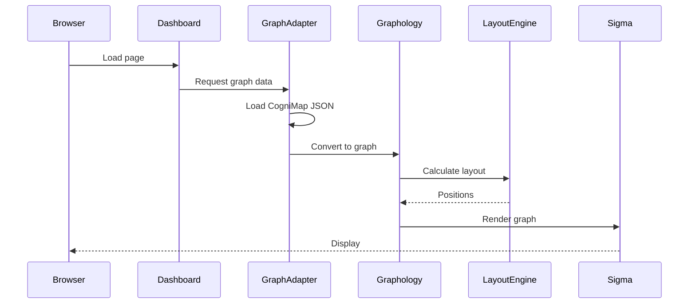
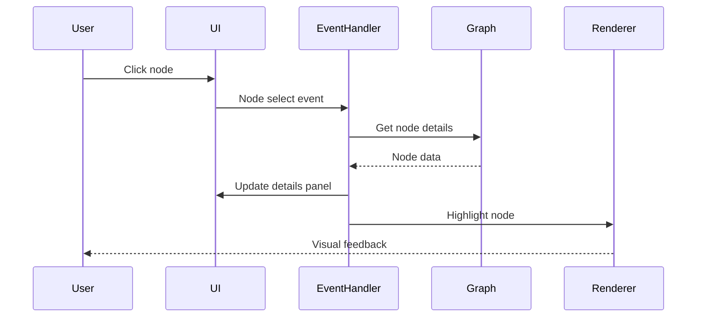
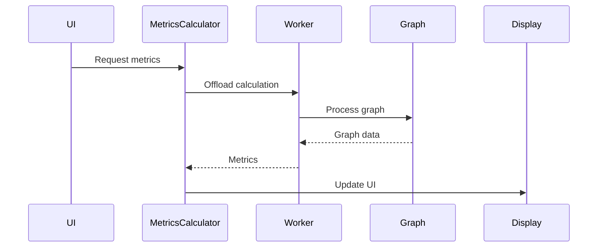

# 🏗️ CogniMap Visualization Architecture

## System Architecture Overview

```
┌─────────────────────────────────────────────────────────────┐
│                         User Interface                       │
│  ┌─────────────┐  ┌──────────────┐  ┌─────────────────┐   │
│  │  Dashboard  │  │   Controls   │  │   Export Menu   │   │
│  └─────────────┘  └──────────────┘  └─────────────────┘   │
└────────────────────────────┬────────────────────────────────┘
                             │
┌────────────────────────────▼────────────────────────────────┐
│                     Visualization Engine                     │
│  ┌──────────────────────────────────────────────────────┐  │
│  │                   Sigma.js Renderer                   │  │
│  │  ┌────────────┐  ┌─────────────┐  ┌──────────────┐  │  │
│  │  │   WebGL    │  │   Canvas    │  │     SVG      │  │  │
│  │  └────────────┘  └─────────────┘  └──────────────┘  │  │
│  └──────────────────────────────────────────────────────┘  │
└────────────────────────────┬────────────────────────────────┘
                             │
┌────────────────────────────▼────────────────────────────────┐
│                      Graph Processing                        │
│  ┌──────────────────────────────────────────────────────┐  │
│  │                 Graphology Core                       │  │
│  │  ┌────────────┐  ┌─────────────┐  ┌──────────────┐  │  │
│  │  │    Graph   │  │   Metrics   │  │  Algorithms  │  │  │
│  │  │  Structure │  │  Calculator │  │   Library    │  │  │
│  │  └────────────┘  └─────────────┘  └──────────────┘  │  │
│  └──────────────────────────────────────────────────────┘  │
└────────────────────────────┬────────────────────────────────┘
                             │
┌────────────────────────────▼────────────────────────────────┐
│                      Data Adapter Layer                      │
│  ┌──────────────────────────────────────────────────────┐  │
│  │                  CogniMap Adapter                     │  │
│  │  ┌────────────┐  ┌─────────────┐  ┌──────────────┐  │  │
│  │  │ Fingerprint│  │   Import    │  │   Metadata   │  │  │
│  │  │   Parser   │  │   Analyzer  │  │   Extractor  │  │  │
│  │  └────────────┘  └─────────────┘  └──────────────┘  │  │
│  └──────────────────────────────────────────────────────┘  │
└────────────────────────────┬────────────────────────────────┘
                             │
┌────────────────────────────▼────────────────────────────────┐
│                      Data Source Layer                       │
│  ┌──────────────┐  ┌──────────────┐  ┌─────────────────┐  │
│  │  GraphBuilder│  │  Fingerprints│  │   Git History   │  │
│  │   (Python)   │  │    (JSON)    │  │   (Optional)    │  │
│  └──────────────┘  └──────────────┘  └─────────────────┘  │
└──────────────────────────────────────────────────────────────┘
```

## Component Architecture

### 1. Frontend Components

```
cognimap/visualizer/frontend/
├── components/
│   ├── GraphCanvas.js         # Main rendering canvas
│   ├── ControlPanel.js        # User controls
│   ├── SearchBar.js           # Node/edge search
│   ├── FilterPanel.js         # Type/tag filters
│   ├── MetricsPanel.js        # Statistics display
│   ├── DetailsPanel.js        # Node/edge details
│   └── ExportDialog.js        # Export options
├── dashboard.html              # Main entry point
└── styles/
    ├── main.css               # Core styles
    └── themes/
        ├── light.css          # Light theme
        └── dark.css           # Dark theme
```

### 2. Visualization Engine

```
cognimap/visualizer/engine/
├── graph-adapter.js           # CogniMap to Graphology
├── sigma-renderer.js          # Sigma.js wrapper
├── layout-manager.js          # Layout algorithms
├── metrics-calculator.js      # Graph metrics
├── event-handler.js           # User interactions
└── export-manager.js          # Export functionality
```

#### 2.1 Graph Adapter

```javascript
class CogniMapGraphAdapter {
  constructor() {
    this.graph = new Graph();
    this.nodeMap = new Map();
    this.edgeMap = new Map();
  }
  
  loadFromCogniMap(data) {
    // Convert CogniMap format to Graphology
    this.convertNodes(data.nodes);
    this.convertEdges(data.edges);
    this.extractMetadata(data);
  }
  
  convertNodes(nodes) {
    nodes.forEach(node => {
      const graphNode = {
        id: node.id,
        label: node.filepath,
        type: node.type,
        fingerprint: node.fingerprint,
        x: Math.random() * 1000,  // Initial position
        y: Math.random() * 1000,
        size: this.calculateNodeSize(node),
        color: this.getNodeColor(node)
      };
      this.graph.addNode(node.id, graphNode);
      this.nodeMap.set(node.id, graphNode);
    });
  }
}
```

#### 2.2 Sigma Renderer

```javascript
class SigmaRenderer {
  constructor(container, graph) {
    this.container = container;
    this.graph = graph;
    this.sigma = null;
    this.camera = null;
  }
  
  initialize() {
    this.sigma = new Sigma(this.graph, this.container, {
      renderLabels: true,
      antialiasing: true,
      defaultNodeType: 'circle',
      defaultEdgeType: 'arrow'
    });
    
    this.setupEventHandlers();
    this.setupCamera();
  }
  
  render() {
    this.sigma.refresh();
  }
}
```

### 3. Algorithm Components

```
cognimap/visualizer/algorithms/
├── centrality.js              # Centrality metrics
├── community-detection.js     # Louvain algorithm
├── dependency-analysis.js     # Circular deps
├── architecture-health.js     # Health scoring
├── path-finding.js           # Shortest paths
└── pattern-detection.js      # Anti-patterns
```

#### 3.1 Centrality Calculator

```javascript
class CentralityCalculator {
  constructor(graph) {
    this.graph = graph;
  }
  
  calculateAll() {
    return {
      betweenness: this.betweennessCentrality(),
      degree: this.degreeCentrality(),
      closeness: this.closenessCentrality(),
      pagerank: this.pageRank()
    };
  }
  
  findCriticalNodes(threshold = 0.8) {
    const centrality = this.betweennessCentrality();
    return Object.entries(centrality)
      .filter(([_, score]) => score > threshold)
      .map(([nodeId, _]) => nodeId);
  }
}
```

### 4. Backend Services

```
cognimap/visualizer/backend/
├── api/
│   ├── graph-api.js          # Graph data endpoints
│   ├── metrics-api.js        # Analysis endpoints
│   └── export-api.js         # Export endpoints
├── workers/
│   ├── layout-worker.js      # Layout calculation
│   ├── metrics-worker.js     # Metrics calculation
│   └── export-worker.js      # Export generation
└── services/
    ├── cache-service.js       # IndexedDB caching
    ├── filter-service.js      # Graph filtering
    └── search-service.js      # Node/edge search
```

## Data Flow

### 1. Initial Load



### 2. User Interaction



### 3. Analysis Request



## Layout Algorithms

### ForceAtlas2 (Default)

```javascript
const forceAtlas2Layout = {
  preApply: () => {
    // Initialize node positions
  },
  
  apply: () => {
    // Main algorithm
    forceAtlas2.assign(graph, {
      iterations: 1000,
      settings: {
        gravity: 1,
        scalingRatio: 10,
        barnesHutOptimize: true
      }
    });
  },
  
  postApply: () => {
    // Finalize positions
  }
};
```

### Hierarchical Layout

```javascript
const hierarchicalLayout = {
  apply: (graph) => {
    // Detect layers
    const layers = detectLayers(graph);
    
    // Position nodes by layer
    layers.forEach((layer, depth) => {
      const nodeCount = layer.length;
      layer.forEach((node, index) => {
        graph.setNodeAttribute(node, 'x', index * 150);
        graph.setNodeAttribute(node, 'y', depth * 200);
      });
    });
  }
};
```

## Performance Optimizations

### 1. Virtualization

```javascript
class GraphVirtualizer {
  constructor(graph, viewport) {
    this.graph = graph;
    this.viewport = viewport;
    this.visibleNodes = new Set();
    this.nodeQuadTree = new QuadTree();
  }
  
  updateVisible() {
    const bounds = this.viewport.getBounds();
    this.visibleNodes = this.nodeQuadTree.query(bounds);
    
    // Hide non-visible nodes
    this.graph.forEachNode((node) => {
      const visible = this.visibleNodes.has(node);
      this.graph.setNodeAttribute(node, 'hidden', !visible);
    });
  }
}
```

### 2. Level of Detail (LOD)

```javascript
class LODManager {
  constructor(camera) {
    this.camera = camera;
    this.zoomLevels = {
      far: { minZoom: 0, maxZoom: 0.5 },
      medium: { minZoom: 0.5, maxZoom: 2 },
      close: { minZoom: 2, maxZoom: 10 }
    };
  }
  
  getCurrentLOD() {
    const zoom = this.camera.getZoom();
    
    if (zoom < 0.5) return 'far';
    if (zoom < 2) return 'medium';
    return 'close';
  }
  
  applyLOD(graph) {
    const lod = this.getCurrentLOD();
    
    graph.forEachNode((node, attributes) => {
      switch(lod) {
        case 'far':
          // Show only major nodes
          attributes.hidden = attributes.metrics.degree < 10;
          attributes.labelHidden = true;
          break;
        case 'medium':
          // Show most nodes
          attributes.hidden = false;
          attributes.labelHidden = attributes.metrics.degree < 5;
          break;
        case 'close':
          // Show everything
          attributes.hidden = false;
          attributes.labelHidden = false;
          break;
      }
    });
  }
}
```

## State Management

```javascript
class VisualizationState {
  constructor() {
    this.state = {
      graph: null,
      selectedNodes: new Set(),
      highlightedNodes: new Set(),
      filters: {
        types: [],
        tags: [],
        search: ''
      },
      layout: 'forceAtlas2',
      metrics: {},
      camera: {
        x: 0,
        y: 0,
        zoom: 1
      }
    };
  }
  
  updateState(changes) {
    this.state = { ...this.state, ...changes };
    this.notifyListeners();
  }
  
  subscribe(listener) {
    this.listeners.push(listener);
  }
  
  notifyListeners() {
    this.listeners.forEach(listener => listener(this.state));
  }
}
```

## Error Handling

```javascript
class ErrorBoundary {
  constructor() {
    this.errors = [];
  }
  
  catch(error, component) {
    this.errors.push({
      timestamp: Date.now(),
      component,
      error: {
        message: error.message,
        stack: error.stack
      }
    });
    
    this.handleError(error, component);
  }
  
  handleError(error, component) {
    switch(component) {
      case 'renderer':
        this.fallbackToCanvas();
        break;
      case 'layout':
        this.useDefaultPositions();
        break;
      case 'metrics':
        this.showPartialMetrics();
        break;
      default:
        this.showErrorMessage(error);
    }
  }
}
```

## Testing Strategy

### Unit Tests

```javascript
describe('GraphAdapter', () => {
  it('should convert CogniMap nodes to Graphology', () => {
    const adapter = new GraphAdapter();
    const cogniMapData = loadTestData();
    adapter.loadFromCogniMap(cogniMapData);
    
    expect(adapter.graph.order).toBe(98);
    expect(adapter.graph.size).toBe(388);
  });
});
```

### Integration Tests

```javascript
describe('Visualization Pipeline', () => {
  it('should render graph end-to-end', async () => {
    const container = document.createElement('div');
    const visualizer = new CogniMapVisualizer(container);
    
    await visualizer.load(testData);
    await visualizer.render();
    
    expect(container.querySelector('canvas')).toBeTruthy();
    expect(visualizer.getNodeCount()).toBe(98);
  });
});
```

### Performance Tests

```javascript
describe('Performance', () => {
  it('should handle 10,000 nodes', async () => {
    const largeGraph = generateLargeGraph(10000);
    const start = performance.now();
    
    await visualizer.load(largeGraph);
    await visualizer.render();
    
    const elapsed = performance.now() - start;
    expect(elapsed).toBeLessThan(5000);
  });
});
```

---

**This architecture document provides the blueprint for implementing the CogniMap visualization system.**