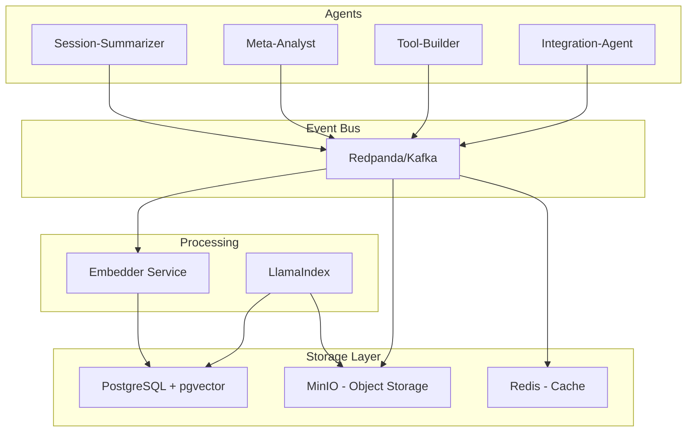

# SemLoop Architecture

## Overview

SemLoop (Semantic Loop) is UMA-V2's memory and analytics infrastructure, providing persistent storage, event streaming, and semantic search capabilities for the multi-agent system.

## Architecture Components



## Data Flow

1. **Event Generation**: Agents emit structured events (tool calls, state changes, completions)
2. **Event Streaming**: Redpanda/Kafka handles pub-sub with topic partitioning
3. **Embedding**: FastAPI service generates embeddings for semantic search
4. **Storage**: Events stored in PostgreSQL (structured) and MinIO (artifacts)
5. **Retrieval**: LlamaIndex provides hybrid search over historical data

## Event Schema

All events follow a standard envelope format (see `schemas/event_envelope.schema.json`):

```json
{
  "id": "uuid-v4",
  "type": "tool_call|state_change|completion|error",
  "timestamp": "ISO-8601",
  "agent": "agent-name",
  "payload": {
    // Event-specific data
  },
  "meta": {
    "session_id": "uma-v2-2024-01-01-001",
    "credits_used": 5,
    "context_hash": "sha256:..."
  }
}
```

## Storage Strategies

### PostgreSQL + pgvector
- **Purpose**: Structured queries + semantic search
- **Schema**: JSONB for events + vector embeddings
- **Indexes**: GIN on JSONB, IVFFlat on vectors
- **Retention**: 90 days hot, then archive to MinIO

### MinIO Object Storage
- **Purpose**: Large artifacts (screenshots, logs, checkpoints)
- **Structure**: `bucket/year/month/day/session_id/artifact`
- **Lifecycle**: Auto-tier to cold storage after 30 days
- **Integration**: Pre-signed URLs for direct agent access

### Redis Cache
- **Purpose**: Real-time metrics, session state
- **TTL**: 24 hours for metrics, 1 hour for state
- **Patterns**: Pub-sub for live updates, sorted sets for leaderboards

## Deployment

See [SemLoop Deployment Guide](./semloop-deployment.md) for detailed setup instructions.

### Quick Start
```bash
# Start the entire stack
make semloop-up

# Check health status
make semloop-health

# Stop and clean up
make semloop-down
```

### Production
- **Kubernetes**: Helm charts in `infra/k8s/`
- **Managed Services**: 
  - AWS MSK for Kafka
  - RDS for PostgreSQL
  - S3 for object storage
  - ElastiCache for Redis

## Integration with Agents

### Writing Events
```python
from semloop_models import EventEnvelope, ToolCallPayload

event = EventEnvelope(
    type="tool_call",
    agent="tool-builder",
    payload=ToolCallPayload(
        tool="sandbox",
        credits=5,
        result="success"
    )
)

await producer.send("agent-events", event.json())
```

### Reading Events
```python
from llama_index import VectorStoreIndex
from llama_index.vector_stores import PGVectorStore

vector_store = PGVectorStore.from_params(
    database="semloop",
    host="localhost",
    embed_dim=1536
)

index = VectorStoreIndex.from_vector_store(vector_store)
results = index.query("failed tool calls in last 24h")
```

## Monitoring

### Metrics
- Event throughput (events/sec)
- Storage usage (GB)
- Query latency (p50/p95/p99)
- Embedding backlog

### Alerts
- Redpanda lag > 1000 messages
- PostgreSQL connections > 80%
- MinIO storage > 80% capacity
- Redis memory > 75%

## Future Enhancements

- [ ] Multimodal embeddings for screenshots
- [ ] Graph database for agent interaction patterns
- [ ] ML pipeline for anomaly detection
- [ ] Distributed tracing integration
- [ ] Cost attribution by team/project

## Migration Path

### Phase 1: Current State
- TinyDB for simple JSON storage
- CSV files for metrics
- YAML for session summaries

### Phase 2: Hybrid Mode
- Keep file-based for read
- Write to both files and SemLoop
- Gradual migration of readers

### Phase 3: Full SemLoop
- All writes to event bus
- File system for backup only
- Full semantic search capability

## Security Considerations

- **Encryption**: TLS for transit, AES-256 for rest
- **Authentication**: mTLS between services
- **Authorization**: RBAC with agent-specific roles
- **Audit**: All access logged to separate stream
- **PII**: Automatic redaction in embeddings

## Cost Optimization

- **Tiering**: Hot/warm/cold storage lifecycle
- **Compression**: Zstd for Redpanda, Snappy for MinIO
- **Sampling**: Configurable event sampling for high-volume agents
- **Retention**: Automatic pruning based on age/importance

## References

- [Redpanda Documentation](https://docs.redpanda.com/)
- [pgvector Extension](https://github.com/pgvector/pgvector)
- [MinIO Best Practices](https://min.io/docs/minio/linux/administration/monitoring.html)
- [LlamaIndex Integration](https://docs.llamaindex.ai/)