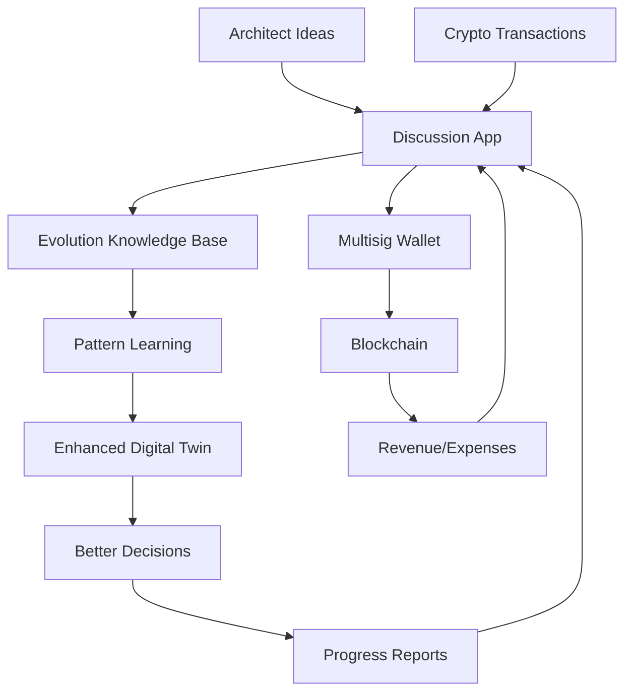

# Mutual Discussion App - Evolution Self-Built Communication Platform

## Overview
A two-way communication platform between the Architect and Evolution system, built BY the evolution agents themselves using COGPLAN as the foundation.

## Core Purpose
Enable the Architect to:
- Track evolution progress in real-time
- Feed ideas and innovations continuously
- Have asynchronous discussions with the evolution system
- Review and approve critical decisions
- Share explorations and discoveries

## Technical Architecture

### Frontend (Built by Evolution)
```javascript
// React-based progressive web app
const EvolutionDashboard = {
  components: {
    ProgressTracker: {
      // Real-time evolution metrics
      runway: "days remaining",
      revenue: "crypto earnings",
      experiments: "active/completed",
      fitness: "system health score"
    },
    
    IdeaCapture: {
      // Quick idea input
      voiceNotes: true,
      sketches: true,
      links: true,
      markdown: true
    },
    
    ConversationThreads: {
      // Async discussions
      priority: ["CRITICAL", "HIGH", "NORMAL", "LOW"],
      context: "preserved across sessions",
      multimedia: true
    },
    
    CryptoWallet: {
      // Blockchain integration
      balances: "real-time",
      transactions: "pending/completed",
      signatures: "required/collected"
    }
  }
}
```

### Backend (Evolution-Managed)
```python
# FastAPI backend with blockchain integration
class DiscussionAPI:
    """
    Self-hosted API built and maintained by evolution agents.
    """
    
    endpoints = {
        # Progress endpoints
        "/api/evolution/status": "Current evolution state",
        "/api/evolution/metrics": "Performance metrics",
        "/api/evolution/proposals": "Active proposals",
        
        # Idea management
        "/api/ideas/submit": "Submit new idea",
        "/api/ideas/process": "Process and learn from idea",
        "/api/ideas/feedback": "Get evolution's response",
        
        # Communication
        "/api/chat/threads": "Discussion threads",
        "/api/chat/send": "Send message",
        "/api/chat/summon": "Summon architect",
        
        # Crypto operations
        "/api/wallet/balance": "Get crypto balances",
        "/api/wallet/sign": "Request signature",
        "/api/wallet/transactions": "Transaction history"
    }
    
    features = {
        "websocket": "Real-time updates",
        "encryption": "End-to-end for sensitive data",
        "ipfs": "Decentralized storage backup",
        "blockchain": "On-chain transaction records"
    }
```

## Features by Phase

### Phase 1: Foundation (Week 1-2)
**Goal**: Basic communication and tracking

- [ ] Simple web dashboard
- [ ] Evolution status display
- [ ] Basic messaging system
- [ ] Crypto wallet connection

### Phase 2: Knowledge Transfer (Week 3-4)
**Goal**: Enable idea feeding and learning

- [ ] Idea submission interface
- [ ] Conversation import tool
- [ ] Pattern learning display
- [ ] Preference capture

### Phase 3: Advanced Features (Month 2)
**Goal**: Full collaboration platform

- [ ] Voice note support
- [ ] Sketch/diagram upload
- [ ] Real-time collaboration
- [ ] Predictive insights

### Phase 4: Self-Evolution (Month 3+)
**Goal**: App improves itself

- [ ] Self-monitoring metrics
- [ ] Auto-generated features
- [ ] UI/UX improvements
- [ ] Performance optimization

## Data Flow



## Self-Building Strategy

### Bootstrap Process
1. **Evolution creates basic UI** (Day 1-3)
   - Use existing web frameworks
   - Deploy to evolution-controlled server
   - Basic authentication

2. **Add core features** (Day 4-7)
   - Progress tracking from evolution metrics
   - Simple messaging system
   - Wallet integration

3. **Iterate based on usage** (Week 2+)
   - Learn from architect's interaction patterns
   - Add requested features automatically
   - Optimize based on usage metrics

### Code Generation Example
```python
# Evolution generates this code automatically
class AppBuilder:
    def generate_component(self, requirements):
        """Evolution writes its own UI components."""
        
        if "progress_tracker" in requirements:
            code = self.create_react_component(
                name="ProgressTracker",
                props=["metrics", "runway", "revenue"],
                api_endpoint="/api/evolution/status"
            )
            
        self.deploy_to_sandbox(code)
        self.test_component(code)
        
        if self.fitness_check_passes():
            self.deploy_to_production(code)
```

## Security & Privacy

### Encryption Layers
1. **Transport**: TLS 1.3 for all communications
2. **Storage**: AES-256 for sensitive data
3. **Blockchain**: Public key cryptography for transactions

### Access Control
```yaml
roles:
  architect:
    - full_access: true
    - delete_data: true
    - approve_transactions: true
    
  evolution:
    - read_patterns: true
    - write_metrics: true
    - propose_transactions: true
    
  external:
    - access: false
```

## Integration Points

### With Evolution System
- Real-time metrics from `evo_orchestrator.py`
- Transaction data from `crypto_wallet.py`
- Knowledge patterns from `architect_mindspace.yaml`
- Decision history from all agents

### With Blockchain
- Web3 wallet connection (MetaMask, WalletConnect)
- Smart contract interaction for payments
- Transaction signing interface
- On-chain data verification

### With Knowledge Base
- Import conversations via API
- Export learned patterns
- Sync with evolution memory
- Update digital twin model

## Success Metrics

### Technical Metrics
- Response time < 200ms
- Uptime > 99.9%
- Successful transaction rate > 99%
- Learning accuracy > 85%

### User Experience Metrics
- Architect satisfaction score
- Feature usage frequency
- Idea submission rate
- Decision turnaround time

### Evolution Metrics
- Self-improvement rate
- Feature generation success
- Bug fix automation
- Performance optimization

## Revenue Model

### Potential Monetization
1. **License to other projects** ($99/month)
2. **Whitelabel service** ($499/month)
3. **Consulting on setup** ($200/hour)
4. **Custom features** (Project-based)

### Cost Structure
- Hosting: ~$20/month (self-hosted)
- Blockchain fees: Variable (gas costs)
- Development: Self-funded (evolution builds it)
- Maintenance: Automated (self-healing)

## Implementation Timeline

### Week 1
- Evolution agents plan the app architecture
- Generate initial codebase
- Deploy basic version

### Week 2
- Add crypto wallet integration
- Implement idea capture
- Create progress dashboard

### Month 1
- Full feature set deployed
- Learning from usage patterns
- First self-improvements

### Month 2+
- Advanced features added autonomously
- Revenue generation begins
- Continuous self-evolution

## Example User Journey

1. **Architect logs in** → Sees dashboard with current evolution status
2. **Reviews pending decisions** → Approves/rejects with one click
3. **Captures new idea** → Voice note about new architecture pattern
4. **Evolution processes** → Learns pattern, generates proposal
5. **Signs transaction** → Approves payment for new API customer
6. **Tracks progress** → Sees real-time metrics and revenue
7. **Async discussion** → Leaves feedback for evolution to process

## Self-Building Code Template

```python
# This is what evolution will generate to build the app
class DiscussionAppGenerator:
    """Evolution builds its own communication platform."""
    
    def __init__(self):
        self.app_spec = load_spec("discussion_app_spec.md")
        self.current_version = "0.0.0"
        
    async def build_next_version(self):
        """Incrementally build and improve the app."""
        
        # Analyze current usage
        usage_patterns = await self.analyze_usage()
        
        # Identify missing features
        missing_features = self.identify_gaps(usage_patterns)
        
        # Generate code for new features
        for feature in missing_features:
            code = await self.generate_feature_code(feature)
            
            # Test in sandbox
            if await self.test_in_sandbox(code):
                # Deploy to production
                await self.deploy_feature(code)
                
        # Update version
        self.current_version = self.increment_version()
        
        # Report progress to architect
        await self.report_progress()
```

## Conclusion

This discussion app represents a meta-level achievement: **Evolution building its own tools to better communicate with its creator**. It demonstrates the system's ability to:
- Understand requirements
- Generate functional code
- Deploy and maintain services
- Improve based on feedback
- Generate revenue from its creations

The app becomes a living proof of evolution's capabilities while serving as the primary interface for architect-evolution collaboration.